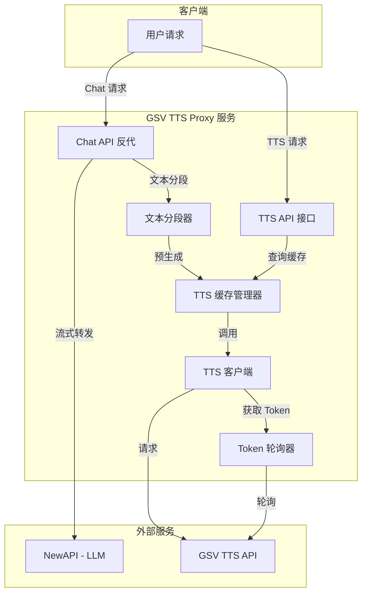
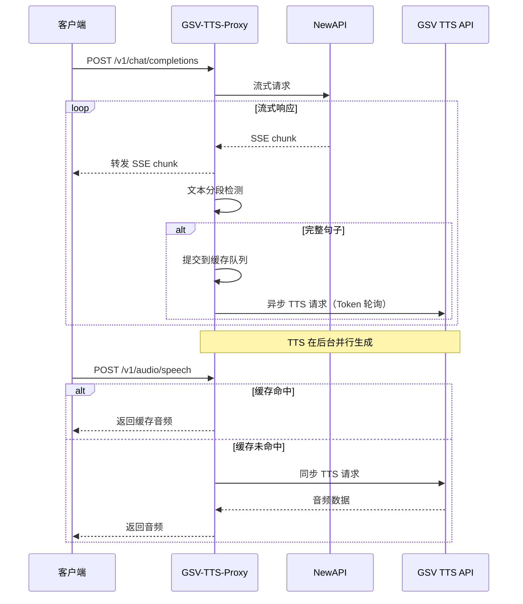

# GSV TTS Proxy 技术方案

## 项目概述

GSV TTS Proxy 是一个基于 `tts-accelerator` 架构的 TTS 代理服务，主要特性：

1. **Token 轮询机制**：支持配置多个 API Token，请求时轮流使用
2. **LLM Chat 代理**：反向代理 OpenAI 兼容的 Chat Completion API
3. **TTS 预生成**：在流式返回 LLM 响应的同时并行预生成 TTS
4. **智能缓存**：相同文本不重复请求
5. **固定请求格式**：只动态修改 `input` 字段，其他参数通过环境变量配置

## 架构图



## 与 tts-accelerator 的主要差异

| 模块 | tts-accelerator | gsv-tts-proxy |
|------|----------------|---------------|
| TTS 后端 | 多个 HuggingFace Space endpoints | 单一 GSV API + 多 Token 轮询 |
| 请求格式 | OpenAI 兼容简单格式 | GSV 特定格式 - 固定参数 |
| 负载均衡策略 | 最少连接算法 | Token 轮询 - Round Robin |
| voice 配置 | 固定值 alloy | 环境变量配置 |

## 目标 TTS API 规格

**Endpoint**: `https://gsv2p.acgnai.top/v1/audio/speech`

**请求格式**（只动态修改 `input` 字段）：
```json
{
  "model": "GSVI-v4",
  "input": "<动态文本>",
  "voice": "<环境变量配置>",
  "response_format": "wav",
  "speed": 1,
  "instructions": "默认",
  "other_params": {
    "text_lang": "中英混合",
    "prompt_lang": "中文",
    "emotion": "默认",
    "top_k": 10,
    "top_p": 1,
    "temperature": 1,
    "text_split_method": "按标点符号切",
    "batch_size": 1,
    "batch_threshold": 0.75,
    "split_bucket": true,
    "fragment_interval": 0.3,
    "parallel_infer": true,
    "repetition_penalty": 1.35,
    "sample_steps": 16,
    "if_sr": false,
    "seed": -1
  }
}
```

## 项目结构

```
gsv-tts-proxy/
├── .env.example
├── Dockerfile
├── docker-compose.yml
├── README.md
├── requirements.txt
└── app/
    ├── __init__.py
    ├── main.py              # 应用入口
    ├── config.py            # 配置管理
    ├── dependencies.py      # API 鉴权
    ├── models/
    │   ├── __init__.py
    │   └── schemas.py       # 数据模型
    ├── routers/
    │   ├── __init__.py
    │   ├── chat.py          # Chat Completion 路由
    │   └── speech.py        # TTS Speech 路由
    └── services/
        ├── __init__.py
        ├── token_rotator.py  # Token 轮询器（新增）
        ├── tts_client.py     # TTS 客户端（替代 tts_balancer）
        ├── tts_cache.py      # TTS 缓存管理器
        ├── text_splitter.py  # 文本分段器
        ├── audio_utils.py    # 音频工具
        └── proxy_client.py   # LLM 代理客户端
```

## 环境变量配置

| 变量名 | 必需 | 默认值 | 说明 |
|--------|------|--------|------|
| `GSV_API_URL` | ❌ | `https://gsv2p.acgnai.top` | GSV TTS API 基础 URL |
| `GSV_API_TOKENS` | ✅ | - | API Token 列表，逗号分隔 |
| `GSV_DEFAULT_VOICE` | ❌ | `原神-中文-胡桃_ZH` | 默认语音角色 |
| `GSV_DEFAULT_MODEL` | ❌ | `GSVI-v4` | 默认 TTS 模型 |
| `NEWAPI_BASE_URL` | ✅ | - | NewAPI 基础 URL |
| `NEWAPI_API_KEY` | ✅ | - | NewAPI API Key |
| `NEWAPI_TIMEOUT` | ❌ | 120 | NewAPI 请求超时（秒） |
| `TTS_REQUEST_TIMEOUT` | ❌ | 60 | TTS 请求超时（秒） |
| `TTS_RETRY_COUNT` | ❌ | 2 | TTS 请求重试次数 |
| `CACHE_MAX_SIZE` | ❌ | 1000 | 缓存最大条目数 |
| `CACHE_TTL` | ❌ | 3600 | 缓存过期时间（秒） |
| `SPLITTER_MAX_LEN` | ❌ | 40 | 分段最大长度 |
| `SPLITTER_MIN_LEN` | ❌ | 5 | 分段最小长度 |
| `LOG_LEVEL` | ❌ | INFO | 日志级别 |
| `HOST` | ❌ | 0.0.0.0 | 服务监听地址 |
| `PORT` | ❌ | 8000 | 服务监听端口 |

## 核心模块设计

### 1. Token 轮询器 (token_rotator.py)

```python
class TokenRotator:
    """
    Token 轮询器 - Round Robin 策略
    
    功能：
    - 维护 Token 列表
    - 轮询分发 Token
    - 标记失败的 Token（可选：临时跳过）
    - 统计 Token 使用情况
    """
    
    def __init__(self, tokens: List[str]):
        self.tokens = tokens
        self.current_index = 0
        self.token_stats = {}  # 统计每个 token 的使用情况
        self._lock = asyncio.Lock()
    
    async def get_next_token(self) -> str:
        """获取下一个 Token（线程安全）"""
        async with self._lock:
            token = self.tokens[self.current_index]
            self.current_index = (self.current_index + 1) % len(self.tokens)
            return token
    
    def report_success(self, token: str):
        """报告 Token 使用成功"""
        pass
    
    def report_failure(self, token: str):
        """报告 Token 使用失败"""
        pass
    
    def get_stats(self) -> Dict:
        """获取统计信息"""
        pass
```

### 2. TTS 客户端 (tts_client.py)

```python
class GSVTTSClient:
    """
    GSV TTS 客户端
    
    功能：
    - 使用固定的请求格式
    - 只动态修改 input 字段
    - 集成 Token 轮询器
    - 支持重试机制
    """
    
    def __init__(
        self,
        api_url: str,
        token_rotator: TokenRotator,
        default_voice: str,
        default_model: str,
        timeout: int = 60,
        retry_count: int = 2,
    ):
        self.api_url = api_url
        self.token_rotator = token_rotator
        self.default_voice = default_voice
        self.default_model = default_model
        self.timeout = timeout
        self.retry_count = retry_count
    
    async def synthesize(self, text: str) -> bytes:
        """
        合成语音
        
        1. 从轮询器获取 Token
        2. 构造固定格式的请求
        3. 发送请求并处理响应
        4. 重试失败的请求（使用不同 Token）
        """
        pass
    
    def _build_request_body(self, text: str) -> dict:
        """构造请求体 - 固定格式，只动态修改 input"""
        return {
            "model": self.default_model,
            "input": text,
            "voice": self.default_voice,
            "response_format": "wav",
            "speed": 1,
            "instructions": "默认",
            "other_params": {
                "text_lang": "中英混合",
                "prompt_lang": "中文",
                "emotion": "默认",
                "top_k": 10,
                "top_p": 1,
                "temperature": 1,
                "text_split_method": "按标点符号切",
                "batch_size": 1,
                "batch_threshold": 0.75,
                "split_bucket": True,
                "fragment_interval": 0.3,
                "parallel_infer": True,
                "repetition_penalty": 1.35,
                "sample_steps": 16,
                "if_sr": False,
                "seed": -1
            }
        }
```

### 3. 复用模块

以下模块可以直接复用或稍作修改：

- **tts_cache.py** - 直接复用，替换 balancer 为 tts_client
- **text_splitter.py** - 直接复用
- **audio_utils.py** - 直接复用
- **proxy_client.py** - 直接复用
- **dependencies.py** - 直接复用

## API 接口

### 1. Chat Completion（反向代理）

与 OpenAI Chat Completion API 完全兼容：

```bash
POST /v1/chat/completions
Authorization: Bearer <NEWAPI_API_KEY>

{
  "model": "gpt-4",
  "messages": [{"role": "user", "content": "你好"}],
  "stream": true,
  "tts_enabled": true,   # 可选，默认 true
  "tts_model": "GSVI-v4" # 可选，默认使用环境变量配置
}
```

### 2. TTS 语音合成

```bash
POST /v1/audio/speech
Authorization: Bearer <NEWAPI_API_KEY>

{
  "model": "GSVI-v4",   # 可选
  "input": "要合成的文本",
  "voice": "xxx"        # 可选，默认使用环境变量配置
}
```

### 3. 其他接口

- `GET /` - 服务信息
- `GET /health` - 健康检查
- `GET /cache/stats` - 缓存统计
- `POST /cache/clear` - 清空缓存
- `GET /v1/models` - 列出模型
- `GET /v1/audio/models` - 列出 TTS 模型
- `GET /tokens/stats` - Token 轮询统计（新增）

## 数据流程

### Chat + TTS 预生成流程



## 实现步骤

1. **创建项目基础结构**
   - 初始化项目目录
   - 创建 requirements.txt
   - 创建 Dockerfile 和 docker-compose.yml
   - 创建 .env.example

2. **实现配置模块** (config.py)
   - 解析环境变量
   - 支持多 Token 配置
   - 支持 voice 环境变量

3. **实现 Token 轮询器** (token_rotator.py)
   - Round-Robin 轮询逻辑
   - 线程安全
   - 统计功能

4. **实现 TTS 客户端** (tts_client.py)
   - 集成 Token 轮询器
   - 固定请求格式
   - 重试机制

5. **复用/修改缓存模块** (tts_cache.py)
   - 替换 balancer 依赖为 tts_client

6. **复用其他模块**
   - text_splitter.py
   - audio_utils.py
   - proxy_client.py
   - dependencies.py

7. **实现路由模块**
   - chat.py - LLM 代理
   - speech.py - TTS API

8. **实现主入口** (main.py)
   - 应用生命周期管理
   - 注册路由
   - 错误处理

9. **创建文档**
   - README.md