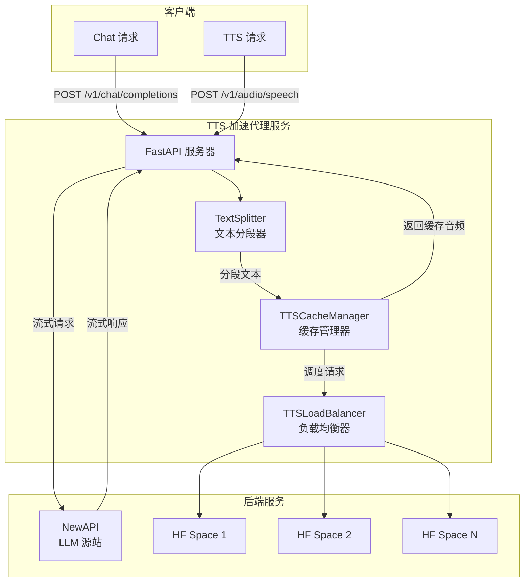
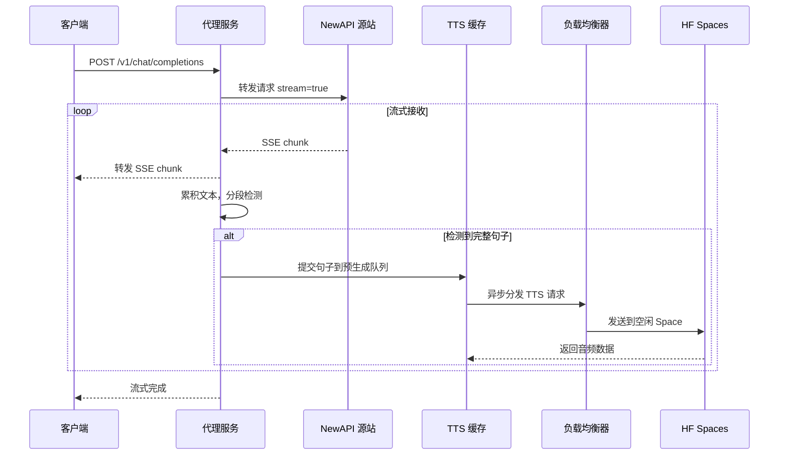
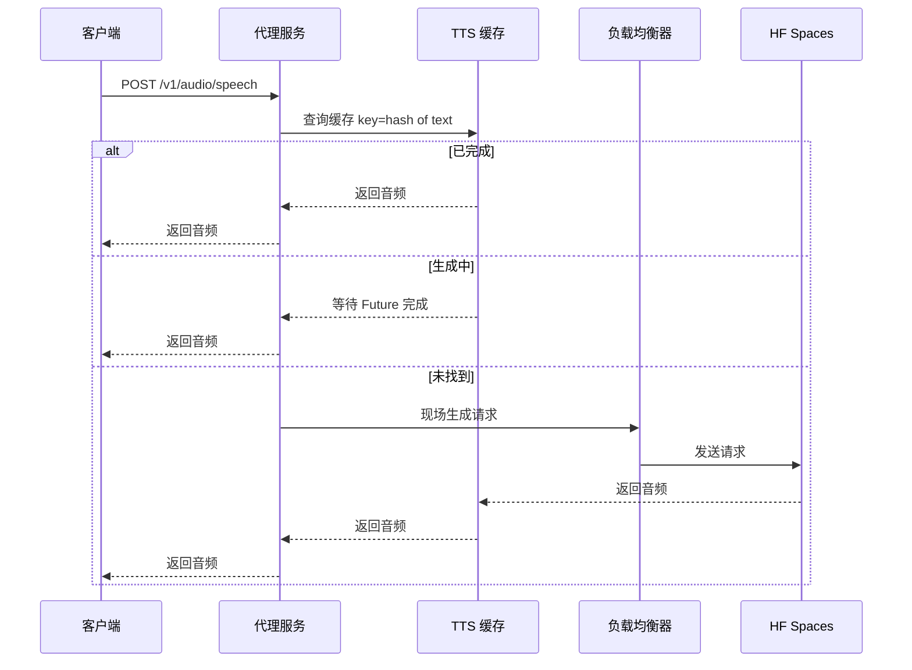

# TTS 加速代理服务 - 架构设计

## 项目概述

这是一个智能 TTS 预取代理服务，通过在流式返回 LLM 响应的同时并行预生成 TTS，大幅减少用户等待 TTS 的时间。

## 核心架构



## 核心流程

### 1. Chat Completion 请求流程



### 2. TTS 获取流程



## 项目结构

```
tts-accelerator/
├── app/
│   ├── __init__.py
│   ├── main.py                 # FastAPI 入口
│   ├── config.py               # 配置管理
│   ├── routers/
│   │   ├── __init__.py
│   │   ├── chat.py             # /v1/chat/completions 路由
│   │   └── speech.py           # /v1/audio/speech 路由
│   ├── services/
│   │   ├── __init__.py
│   │   ├── text_splitter.py    # 流式文本分段器
│   │   ├── tts_cache.py        # TTS 缓存管理器
│   │   ├── tts_balancer.py     # TTS 负载均衡器
│   │   └── proxy_client.py     # NewAPI 代理客户端
│   └── models/
│       ├── __init__.py
│       └── schemas.py          # Pydantic 模型
├── requirements.txt
├── Dockerfile
├── docker-compose.yml
└── README.md
```

## 核心模块设计

### 1. TextSplitter - 流式文本分段器

复用现有的 `TextSplitter` 类，但增加流式处理能力：

```python
class StreamingTextSplitter:
    def __init__:
        self.splitter = TextSplitter
        self.buffer = 
        
    def feed text: str -> List of str:
        # 累积文本到缓冲区
        # 检测完整句子
        # 返回可以发送的句子列表
        pass
    
    def flush -> Optional of str:
        # 返回缓冲区中剩余的文本
        pass
```

### 2. TTSCacheManager - 缓存管理器

```python
class TTSCacheEntry:
    text: str                    # 原文本
    audio: Optional of bytes     # 音频数据
    future: Optional of Future   # 生成中的 Future
    created_at: float            # 创建时间
    status: enum                 # pending/generating/completed/failed

class TTSCacheManager:
    def __init__:
        self.cache: Dict of str to TTSCacheEntry = dict
        self.lock = asyncio.Lock
        self.max_cache_size = 1000
        self.ttl = 3600  # 1小时过期
    
    async def submit text: str, priority: int = 0:
        # 提交文本到预生成队列
        # 创建缓存条目
        # 启动异步生成任务
        pass
    
    async def get text: str, timeout: float = 30 -> bytes:
        # 获取音频，等待生成完成
        pass
    
    def _generate_cache_key text: str -> str:
        # 使用 SHA256 生成缓存 key
        pass
```

### 3. TTSLoadBalancer - 负载均衡器

```python
class TTSEndpoint:
    url: str                     # Space URL
    is_available: bool           # 是否可用
    current_load: int            # 当前负载
    last_request_time: float     # 最后请求时间
    error_count: int             # 连续错误次数

class TTSLoadBalancer:
    def __init__, endpoints: List of str:
        self.endpoints: List of TTSEndpoint = list
        self.semaphores: Dict of str to asyncio.Semaphore = dict  # 每个端点的并发限制
        
    async def request text: str, model: str -> bytes:
        # 选择最优端点
        # 发送请求
        # 处理失败重试
        pass
    
    def _select_endpoint -> TTSEndpoint:
        # 最少连接算法
        pass
    
    async def health_check:
        # 定期检查端点健康状态
        pass
```

### 4. ProxyClient - NewAPI 代理客户端

```python
class ProxyClient:
    def __init__, base_url: str, api_key: str:
        self.base_url = base_url
        self.api_key = api_key
        self.client = httpx.AsyncClient
    
    async def stream_chat request: ChatRequest -> AsyncIterator of str:
        # 转发请求到 NewAPI
        # 流式返回响应
        pass
```

## API 接口设计

### POST /v1/chat/completions

**请求**：与 OpenAI Chat Completions API 完全兼容

```json
{
    "model": "gpt-4",
    "messages": [
        {"role": "user", "content": "Hello"}
    ],
    "stream": true
}
```

**响应**：与 OpenAI SSE 格式完全兼容，同时在后台预生成 TTS

**特殊 Header**：
- `X-TTS-Model`: 指定 TTS 模型（可选，默认使用配置）
- `X-TTS-Enabled`: 是否启用 TTS 预生成（默认 true）

### POST /v1/audio/speech

**请求**：与 OpenAI TTS API 兼容

```json
{
    "model": "liang",
    "input": "要合成的文本",
    "voice": "alloy",
    "response_format": "wav"
}
```

**响应**：WAV 音频文件

**特殊行为**：
- 如果文本已预生成：立即返回
- 如果正在生成：等待完成后返回
- 如果未找到：现场生成

### GET /health

健康检查接口，返回服务状态和各 Space 状态。

### GET /cache/stats

返回缓存统计信息（命中率、大小等）。

## 配置设计

```yaml
# config.yaml
server:
  host: 0.0.0.0
  port: 8000

llm:
  base_url: https://your-newapi.com
  api_key: ${NEWAPI_API_KEY}
  timeout: 60

tts:
  default_model: liang
  endpoints:
    - https://space1.hf.space
    - https://space2.hf.space
    - https://space3.hf.space
  max_concurrent_per_endpoint: 3
  request_timeout: 30
  retry_count: 2

cache:
  max_size: 1000
  ttl_seconds: 3600
  cleanup_interval: 300

splitter:
  max_len: 40
  min_len: 5
```

## 环境变量

```bash
# 必需
NEWAPI_BASE_URL=https://your-newapi.com
NEWAPI_API_KEY=sk-xxx
TTS_ENDPOINTS=https://s1.hf.space,https://s2.hf.space

# 可选
TTS_DEFAULT_MODEL=liang
TTS_MAX_CONCURRENT=3
CACHE_MAX_SIZE=1000
CACHE_TTL=3600
```

## 部署方式

### Docker Compose

```yaml
version: '3.8'
services:
  tts-accelerator:
    build: .
    ports:
      - "8000:8000"
    environment:
      - NEWAPI_BASE_URL=${NEWAPI_BASE_URL}
      - NEWAPI_API_KEY=${NEWAPI_API_KEY}
      - TTS_ENDPOINTS=${TTS_ENDPOINTS}
    restart: unless-stopped
```

## 关键技术点

### 1. 流式文本分段

在流式接收 LLM 响应时，需要实时检测完整句子：

```python
async def handle_stream:
    splitter = StreamingTextSplitter
    
    async for chunk in llm_stream:
        # 转发给客户端
        yield chunk
        
        # 累积并检测句子
        sentences = splitter.feed extract_text from chunk
        for sentence in sentences:
            # 异步提交 TTS 生成，不阻塞流式返回
            asyncio.create_task cache.submit sentence
    
    # 处理剩余文本
    remaining = splitter.flush
    if remaining:
        asyncio.create_task cache.submit remaining
```

### 2. 并发控制

使用信号量控制每个 Space 的并发请求数：

```python
class TTSLoadBalancer:
    async def request text, model:
        endpoint = self._select_endpoint
        
        async with self.semaphores of endpoint:
            return await self._do_request endpoint, text, model
```

### 3. 缓存 Key 设计

使用文本内容的 SHA256 哈希作为缓存 key：

```python
def _generate_cache_key text: str, model: str -> str:
    content = f"{model}:{text}"
    return hashlib.sha256 content.encode.hexdigest
```

### 4. 优雅的错误处理

```python
async def submit_with_retry text, model, max_retries=2:
    for attempt in range max_retries + 1:
        try:
            return await balancer.request text, model
        except TTSError as e:
            if attempt == max_retries:
                raise
            await asyncio.sleep 1 * attempt  # 指数退避
```

## 性能优化

1. **预热缓存**：对常用短语预生成 TTS
2. **智能分段**：根据语义边界分段，避免断句问题
3. **连接池**：复用 HTTP 连接
4. **异步 IO**：全异步设计，最大化并发
5. **缓存淘汰**：LRU + TTL 双重策略

## 监控指标

- TTS 缓存命中率
- 各 Space 响应时间
- 各 Space 错误率
- 平均 TTS 生成时间
- 队列深度

## 待确认问题

1. 是否需要支持流式返回 TTS 音频？
2. 是否需要支持多种音频格式（mp3, opus 等）？
3. 缓存是否需要持久化（重启后保留）？
4. 是否需要 API 认证？